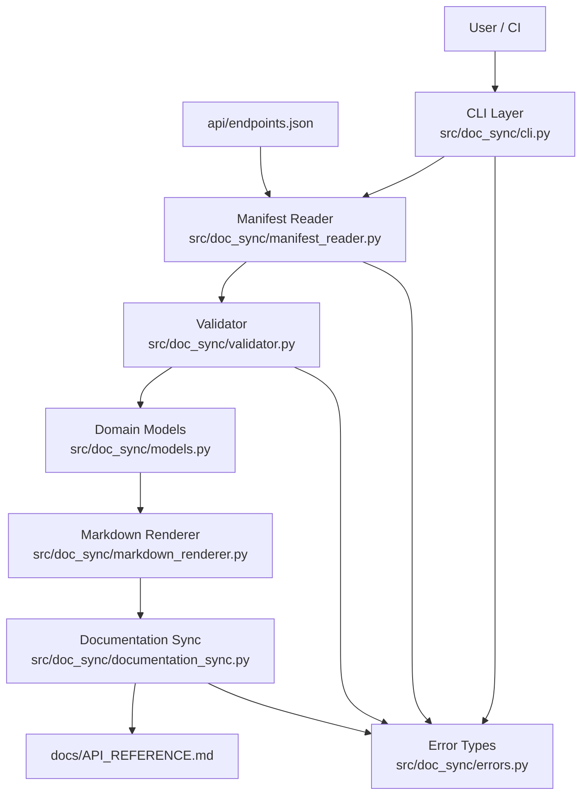

# Architecture: Automated Documentation Sync

## 1. Architecture Goals
- Provide a deterministic Python 3.11+ CLI that generates API reference Markdown from a JSON manifest.
- Ensure safe, bounded synchronization by modifying content only between:
  - `<!-- DOCS_SYNC:START -->`
  - `<!-- DOCS_SYNC:END -->`
- Preserve all Markdown content outside the generated marker block.
- Support two explicit operation modes:
  - `--write`: update stale generated content.
  - `--check`: detect stale generated content without modification.
- Return predictable exit codes (`0`, `1`, `2`) for CI and developer workflows.
- Keep runtime lightweight with standard library-first design and strong input validation.

## 2. Technology Choices and Rationale
- **Language/runtime:** Python 3.11+ for compatibility with project requirements and modern typing support.
- **CLI parsing:** `argparse` (standard library) to avoid unnecessary runtime dependencies.
- **Filesystem handling:** `pathlib.Path` for robust, cross-platform path operations.
- **JSON handling:** `json` (standard library) for JSON-only manifest support.
- **Data modeling:** `dataclasses` and `typing` for typed, explicit domain models.
- **Quality tooling:**
  - Ruff for linting and formatting validation.
  - pytest for unit and CLI integration tests.
- **CI platform:** GitHub Actions for Pull Request validation gates.

## 3. High-Level Component Diagram

## 4. Components and Responsibilities
- `src/doc_sync/cli.py`
  - Parse and validate CLI arguments (`--write`, `--check`, `--manifest`, `--output`).
  - Enforce mode rule: exactly one of `--write` or `--check`.
  - Orchestrate end-to-end flow and map failures to exit codes (`0`, `1`, `2`).
- `src/doc_sync/manifest_reader.py`
  - Resolve manifest path (default `api/endpoints.json` or `--manifest`).
  - Use `pathlib.Path` for path resolution and file access.
  - Validate that the manifest file exists before reading.
  - Verify readability and parse JSON.
  - Raise typed parse/file errors for CLI mapping.
- `src/doc_sync/validator.py`
  - Validate root fields: `serviceName`, `version`, `endpoints`.
  - Validate `endpoints` is non-empty.
  - Validate each endpoint contains `method`, `path`, `summary`, `authentication`.
  - Enforce allowed, case-sensitive methods: `GET`, `POST`, `PUT`, `PATCH`, `DELETE`.
- `src/doc_sync/models.py`
  - Define typed dataclasses for manifest and endpoint entities.
  - Provide normalized in-memory representation for rendering.
- `src/doc_sync/markdown_renderer.py`
  - Generate deterministic Markdown fragment containing:
    - Service name
    - Version
    - Endpoint table (`Method`, `Path`, `Description`, `Authentication`)
  - Normalize endpoint values before table rendering so Markdown remains valid.
  - Replace or escape pipe characters (`|`) and line breaks in cell values.
- `src/doc_sync/documentation_sync.py`
  - Resolve output path (default `docs/API_REFERENCE.md` or `--output`).
  - Use `pathlib.Path` for path resolution and file access.
  - Validate that the output file exists before reading.
  - Enforce exactly one `<!-- DOCS_SYNC:START -->` marker and exactly one `<!-- DOCS_SYNC:END -->` marker.
  - Require the start marker to appear before the end marker.
  - Complete marker validation before any output file change is attempted.
  - In `--check`, compare generated block with current block and report stale/current.
  - In `--write`, replace only marker-bounded block when stale.
  - In `--write`, if content is already current, return exit code `0`, display "No update required", and perform no file write.
  - Preserve all content outside marker boundaries exactly.
- `src/doc_sync/errors.py`
  - Define explicit exception classes/categories for:
    - CLI argument errors
    - File missing/path errors
    - JSON parse errors
    - Manifest validation errors
    - Marker structure/order errors
    - Stale documentation signal for check mode

## 5. Data Flow
1. CLI receives arguments.
2. CLI determines mode and resolves paths:
   - Manifest default: `api/endpoints.json`
   - Output default: `docs/API_REFERENCE.md`
3. Manifest reader loads and parses JSON input.
4. Validator validates root fields, endpoint list, endpoint fields, and method constraints.
5. Markdown renderer normalizes endpoint values (including pipe and line-break handling) and builds the generated API reference fragment.
6. Documentation sync loads output Markdown and validates marker constraints:
   - exactly one `<!-- DOCS_SYNC:START -->` marker
   - exactly one `<!-- DOCS_SYNC:END -->` marker
   - marker order (`START` before `END`)
   - validation completes before any write operation
   - invalid marker conditions stop processing with no file modification
7. Mode execution:
   - `--check`: compare existing marker-bounded content with generated fragment; return stale/current status only.
   - `--write`: if stale, replace only marker-bounded content; if current, return exit code `0`, show "No update required", and perform no write.
8. CLI returns mapped exit code.

## 6. CLI Design
- Command entry point: `docs-sync = doc_sync.cli:main`
- Arguments:
  - `--write`
  - `--check`
  - `--manifest <path>` (optional)
  - `--output <path>` (optional)
- Mode contract:
  - Exactly one of `--write` or `--check` is required.
  - Both modes or neither mode => invalid arguments.
- Exit code contract:
  - `0`: successful write, no changes needed, or docs current; in `--write` mode when current, output a clear "No update required" message and do not write files.
  - `1`: docs stale in `--check` mode.
  - `2`: invalid args, missing files, invalid JSON, invalid manifest, missing/invalid markers.

## 7. File and Module Design
Planned source layout:
- `src/doc_sync/models.py`
- `src/doc_sync/errors.py`
- `src/doc_sync/manifest_reader.py`
- `src/doc_sync/validator.py`
- `src/doc_sync/markdown_renderer.py`
- `src/doc_sync/documentation_sync.py`
- `src/doc_sync/cli.py`

Design rules:
- Keep business logic out of CLI parsing layer.
- Keep validation centralized in `validator.py`.
- Keep synchronization/marker logic centralized in `documentation_sync.py`.
- Use `pathlib.Path` for all file operations across modules.
- Validate file existence before read operations for manifest and output documentation files.
- Use typed dataclasses to reduce shape ambiguity across components.
- Prefer pure functions where possible to simplify unit testing.

## 8. Error Handling Strategy
- Use structured, typed errors from each layer and map in CLI to exit code `2`, except stale check result mapped to `1`.
- Fail fast on invalid arguments and validation failures.
- Error cases covered:
  - Missing or invalid file paths
  - Missing manifest file
  - Missing output documentation file
  - Invalid JSON
  - Missing required manifest fields
  - Empty endpoints list
  - Missing endpoint required fields
  - Unsupported HTTP methods
  - Missing markers
  - Invalid marker order
  - Multiple marker pairs
- Error messages include failing file path and relevant field/condition when possible.
- Any failure in validation/sync MUST NOT modify output file.
- Marker validation failures (missing, duplicate, or wrong order) always result in zero output-file modification.

## 9. Security and File-Safety Controls
- No secrets, tokens, credentials, private URLs, environment files, external API calls, or database integration.
- Local-only file processing; no network dependency.
- No network paths or external file services are used.
- Explicit marker-bounded replacement prevents accidental overwrite of manual documentation sections.
- Preserve non-generated content exactly outside marker boundaries.
- In `--check` mode, enforce read-only behavior (no file writes).
- If markers are missing, reversed, or ambiguous (multiple pairs), abort safely without modification.
- Governance control: major changes require explicit human approval before implementation, commit, push, PR creation, file deletion, or destructive Git operations.

## 10. Testing Strategy
- **Unit tests (pytest):**
  - manifest parsing and JSON failures
  - schema and endpoint validation rules
  - method validation and case sensitivity
  - markdown rendering structure
  - marker detection and replacement logic
  - exit code mapping
- **CLI integration tests (pytest):**
  - use `tmp_path` temporary directories and fixture files
  - must not modify repository source files, manifest files, or documentation files
  - `--check` stale -> exit `1`
  - `--check` current -> exit `0`
  - `--write` stale update -> exit `0`
  - `--write` current -> exit `0` with "No update required" and no file write
  - invalid args (both modes / no mode) -> exit `2`
  - missing files, invalid JSON, invalid marker order, duplicate markers -> exit `2`
- **Regression focus:** preservation of all content outside marker block.

## 11. GitHub Actions Pull Request Validation Design
- Trigger: Pull Requests.
- Pipeline stages:
  1. Ruff lint check.
  2. Ruff format verification.
  3. pytest unit tests.
  4. pytest integration tests.
  5. Documentation freshness validation via `docs-sync --check` using default paths (`api/endpoints.json` and `docs/API_REFERENCE.md`) only.
- Merge gate behavior:
  - Any non-zero status fails the PR check.
  - `docs-sync --check` stale condition (exit `1`) fails validation until docs are updated.
  - CI must never run write mode, modify documentation, commit generated files, or push changes.

## 12. Requirement Traceability
| Architecture Component | Responsibility Summary | FR Coverage | NFR Coverage |
| --- | --- | --- | --- |
| `src/doc_sync/cli.py` | Argument parsing, mode enforcement, orchestration, exit code mapping | FR-014, FR-015, FR-016, FR-017, FR-022, FR-023 | NFR-004, NFR-006 |
| `src/doc_sync/manifest_reader.py` | Manifest path resolution, file checks, JSON parsing | FR-002, FR-003, FR-018, FR-020 | NFR-001, NFR-002, NFR-012 |
| `src/doc_sync/validator.py` | Root/endpoint validation and method enforcement | FR-005, FR-006, FR-007, FR-008, FR-008a, FR-021 | NFR-003, NFR-004, NFR-012 |
| `src/doc_sync/models.py` | Typed domain models for manifest/endpoints | FR-005, FR-007 | NFR-003 |
| `src/doc_sync/markdown_renderer.py` | Deterministic generated API reference markdown | FR-009, FR-010 | NFR-001, NFR-006 |
| `src/doc_sync/documentation_sync.py` | Output path resolution, marker validation, stale detection, bounded write, content preservation | FR-004, FR-011, FR-012, FR-013, FR-019, FR-024 | NFR-005, NFR-012 |
| `src/doc_sync/errors.py` | Typed error taxonomy and diagnostics | FR-018, FR-019, FR-020, FR-021, FR-023, FR-024 | NFR-004, NFR-012 |
| GitHub Actions PR validation design | Lint, format, tests, docs freshness gate | FR-015 | NFR-007, NFR-008 |
| Security/file-safety controls | Local-only processing and protected writes | FR-011, FR-012, FR-013 | NFR-005, NFR-009 |
| Architecture baseline and governance | Python 3.11+ runtime baseline and explicit human approval gate for major changes | FR-001 | NFR-010, NFR-011 |

## 13. Human Approval

- Reviewer: Parag Bansal
- Review Date: 2026-<MM>-<DD>
- Status: Approved
- Notes: High-level architecture reviewed. The proposed modular Python design,
  safe marker replacement strategy, CLI behavior, and verification approach are
  approved for design review.

## Design Review Updates

| Review ID | Architecture Update |
|---|---|
| DR-001 | Added strict single-marker validation and no-write-on-validation-failure behavior. |
| DR-002 | Added pathlib-based file validation and local-only file-operation constraints. |
| DR-003 | Added Markdown table value normalization requirements. |
| DR-004 | Defined no-change behavior for --write mode. |
| DR-005 | Defined temporary-directory isolation for CLI integration tests. |
| DR-006 | Defined check-only, non-mutating GitHub Actions behavior. |
